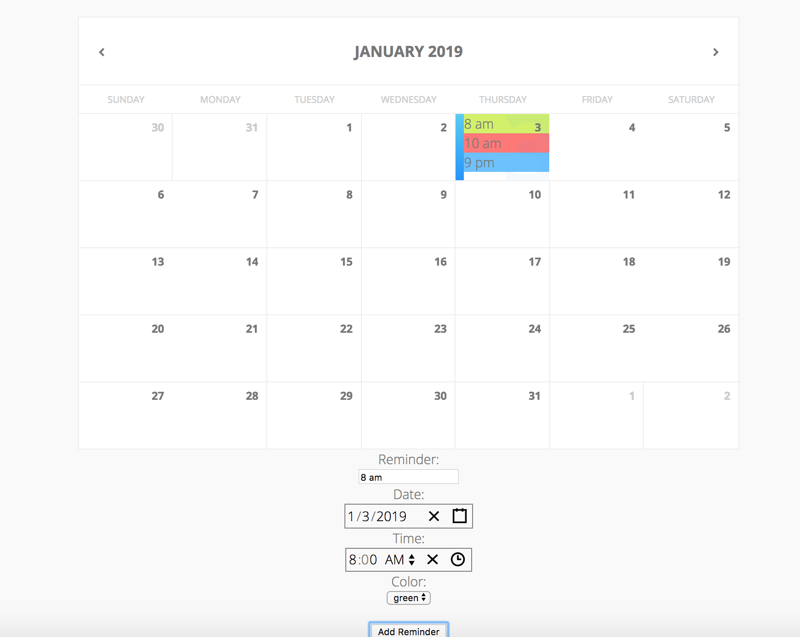

# Mortgage Hub Calendar Demo

Code for the calendar component (Calendar.jsx) comes from: https://github.com/moodydev/react-calendar

## Features & Requirements:
[x] Ability to add a new "reminder" (max 30 chars) for a user entered day and time.
[x] Display reminders on the calendar view in the correct time order.
[x] Allow the user to select a color when creating a reminder and display it appropriately.
[x] Properly handle overflow when multiple reminders appear on the same date.
[ ] Ability to edit reminders - including changing text, day and time & color.
[ ] Ability to delete reminders.
[x] Expand the calendar to support more than current month.

To start it in your environment, clone the repo and while in folder, execute following commands

~~~
yarn install
yarn start
~~~
